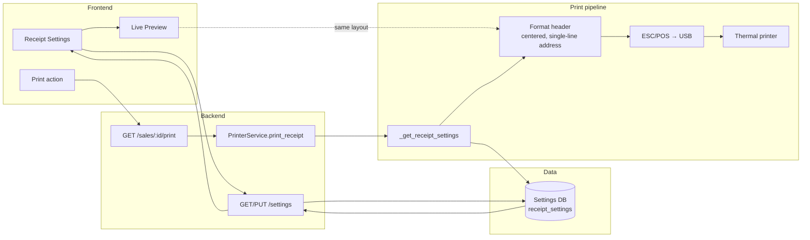

# Receipt printing flow (axon graph)

This document describes the end-to-end flow of receipt configuration and printing so the **printed receipt matches the settings preview** exactly.

## Axon-style flow (step-by-step)

| Step | Component | Action |
|------|-----------|--------|
| 1 | **ReceiptSettings.tsx** | User edits business name, address (single line), phone. Preview shows centered header, full-width address in one line. |
| 2 | **ReceiptSettings.tsx** | On Save → `put(/settings)` with `receipt_settings: { businessName, businessAddress, businessPhone, ... }`. |
| 3 | **Settings API** | Persists `config.receipt_settings` (e.g. in Setting table, branch_id = null or branch). |
| 4 | **User** | Triggers print (e.g. from Transaction details or Sale complete). |
| 5 | **Frontend** | `POST /sales/:sale_id/print` with sale context. |
| 6 | **sales.py** | Builds `receipt_data` (items, totals, operator, branch), calls `PrinterService().print_receipt(receipt_data)`. |
| 7 | **printer_service.py** | `print_receipt()` → `_get_receipt_settings(branch_id)` loads same keys as UI (businessName, businessAddress, businessPhone, etc.). |
| 8 | **printer_service.py** | **Header block (aligned with preview):** `align='center'`, print business name; then address as **one line** (no comma→newline split), then phone; then separator. |
| 9 | **printer_service.py** | Body: `align='left'` for OP, Store, date/time, items, subtotal, tax, total; then footer centered. |
| 10 | **printer_service.py** | Sends ESC/POS commands to USB thermal printer; cut; disconnect. |

## Alignment with settings preview

- **Preview (ReceiptSettings.tsx):** `text-center` for business name and address block; address + phone in one block; `whitespace-pre-line` (user can use newlines; if they type one line, one line is shown).
- **Printer (printer_service.py):** Header uses `align='center'`. Address is printed as a **single line** (newlines in stored value collapsed to space) so it matches “address in single line” in settings. Business name and phone are also centered.

Result: **Printed receipt matches the settings preview** (centered header, full-width single-line address).
